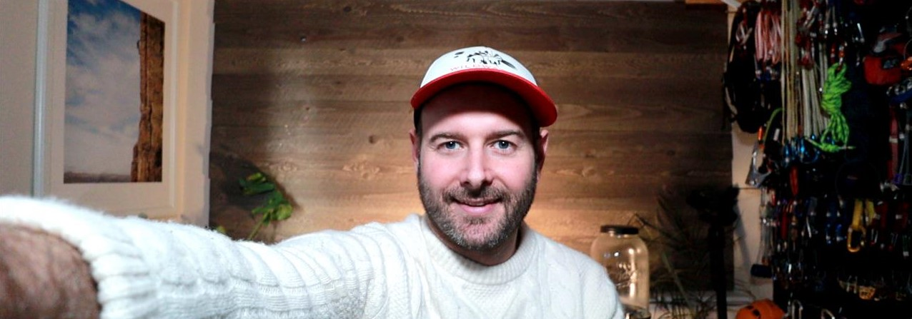

<!-- **JonathanBuchner/JonathanBuchner** is a ✨ _special_ ✨ repository because its `README.md` (this file) appears on your GitHub profile. -->

# Greetings!
On GitHub, I am:
- Exploring projects I may later use as examples in class and work on with my students
- Revisiting algorithm and datastructure trainings 

### My passions include
- Raft guiding, climbing instructing, backcountry skiing, and walking around outdoors
- Supporting and challenging others to drive their learning and self-development
- Making and drinking dark beer

### Language and Frameworks I use
- C#, .NET 5 (ASP.NET), .NET Framework 
- TypeScript, Electron, Vue
- TSQL, Mongo DB

### Contact me at:
- me@jonathanbuchner.com
- https://www.linkedin.com/in/buchner/

# Professional

### Microsoft Leap Instructor

Currently instructing and developing curriculum for the Microsoft Leap Apprenticeship Program.  The Microsoft Leap program recruits, develops, and upskills unconventional talent for employability into the technology industry worldwide.

---

### **Envision**  Developer

Part of a three-person engineering team to capture computure screen medie, process the media in the cloud and stream media to review and training applications.

#### *Project:* Smart Agent Client
Cross-platform desktop application that capture user’s computer screen, program audio, and scrapes bi-data.

#### *Project:* Media Player
Removed resource-intensive media processing out of Azure to clients and simplified solution 

---

### **Epicodus** Instructor

I taught two a 15-week evening programming courses on web development

---

